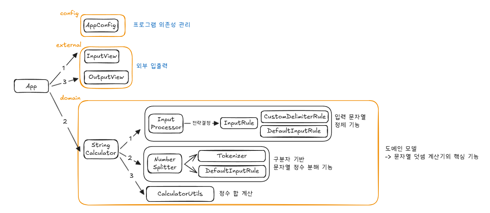

# java-calculator-precourse

# 문자열 덧셈 계산기

## 구현할 기능 목록 (Feature List)

## [문자열 계산 기능]

### 1. **입력 정제 (Input Processing)**

- [X] 입력이 "//[구분자]\n[숫자들]" 형식이면 커스텀 구분자를 추출한다
    - [X] 커스텀 구분자가 있으면 기본 구분자에 추가한다. (중복은 제거)
    - [X] 구분자 뒤의 숫자들만 문자열로 추출한다.
- [X] 그 외의 모든 입력 형식은 입력받은 문자열과, 기본 구분자를 반환한다.

### 2. **숫자 추출 (Number Extraction)**

#### 2-1. 토큰화 (Tokenizer)

- [X] 입력 문자열을 구분자로 분리한다.
- [X] 빈 입력일 경우 빈 리스트를 반환한다.
- [X] 여러 구분자가 섞여 있어도 모두 적용된다.

#### 2-2. 숫자 검증 및 변환 (NumberValidator)

- [X] 각 토큰이 올바른 정수인지 검증한다.
    - [X] 음수가 포함되면 `IllegalArgumentException` 발생
    - [X] 0이 포함되면 `IllegalArgumentException` 발생
    - [X] 선행 0이 포함되면 `IllegalArgumentException` 발생
    - [X] 숫자가 아닌 값이 포함되면 `IllegalArgumentException` 발생
    - [X] 공백이 포함된 값은 `IllegalArgumentException` 발생
- [X] 검증이 끝난 숫자를 양의 정수로 변환한다.

### 3. **계산 (Calculation)**

- [X] 추출된 숫자들을 모두 더해서 반환한다.
- [X] 입력 문자열이 비어있으면 합계는 0을 반환한다.

 

### [입출력 처리 기능]

### 1. **입력 처리 (Input Handling)**

- [X] 콘솔로부터 문자열 입력을 받는다.

~~- 입력이 비어있는 경우(`""`) 0을 반환한다.~~

~~- 입력 문자열이 잘못된 형식일 경우 `IllegalArgumentException`을 발생시킨다.~~

### 2. **출력 처리 (Output Handling)**

- [X] 계산된 합을 `"결과 : [합]"` 형태로 출력한다.

---

## +) 이번 주차 추가 목표

- [X] TDD로 구현해보기

- [X] 우아한 테크코스 커밋, [컨벤션](https://github.com/woowacourse/woowacourse-docs/blob/main/cleancode/pr_checklist.md) 지키기

---

## 최종 아키텍처

## 1주차 최종 소감

### 고민한 점

- **기능 단위와 클래스 분리**
    - 처음에는 어떤 단위로 테스트를 쪼개야 할지, 어떤 클래스로 나눠야 할지 명확하지 않았습니다.
    - 기능 파악 → 도메인 분리 → 클래스 분할이라는 흐름을 잡는 데 시간이 많이 들었고, 구조를 정하는 초기 부담이 컸습니다.

- **전략 패턴 적용**
    - 구분자를 처리하는 부분에서 전략 패턴을 도입했습니다.
    - 커스텀 구분자가 추가되면 문자열을 잘라내는 로직과 충족 여부를 따지는 로직을 어떻게 나눌지 고민했고, 최종적으로 “지원 여부 판단”만을 전략에 위임하는 방식으로 단순화했습니다.
    - 다만 순서가 도메인적 의미를 가질 수 있어, 설계 시점에 규칙 적용 순서를 명확히 정의해야 한다는 점도 배웠습니다.

- **ParsedInput 레코드 클래스**
    - 문자열, 구분자가 하나의 묶음이라고 생각해 별도의 레코드 클래스를 만들었습니다.
    - 외부에서 참조되는 위치를 어디에 둘지(패키지 구조 상의 역할 구분)도 고민했습니다.

- **정적 메소드 vs 객체 주입**
    - 유틸 성격의 단순 연산은 정적 메소드가 간결했지만, 테스트 용이성과 확장성을 고려하여 의존성 주입이 필요했습니다.
    - 객체 주입은 AppConfig를 활용해 한 클래스에서 담당했습니다.

- **테스트 관리**
    - 기능이 추가되거나 비즈니스 로직이 변경될 때마다 테스트 코드도 함께 수정되는 경우가 있었습니다. (초기 설계 문제 or 구현과 가독성을 위한 변경)
    - Support 클래스를 두어 공통 테스트 의존성을 관리하는 방식으로 수정 중복을 줄일 수 있었습니다.

### 소감

기존의 개발 방식은 주로 요구사항을 기반으로, 입력 → 비즈니스 로직 → 출력의 순차적인 흐름을 따라 기능을 구현하는 방식이었습니다.
이러한 방식은 빠르게 결과를 도출할 수 있으나, 구조적인 유연성이나 확장성 측면에서는 한계를 갖는 경우가 많았던 것 같습니다.

이번에는 TDD 방식을 시도했습니다. 개발 전 기능 선언에 맞추어, 클래스와 함수를 고려한 테스트 코드를 작성했습니다.
프로그램이 수행해야 할 가장 큰 목표를 먼저 설정한 뒤, 이를 달성하기 위한 기능들을 도메인 관점에서 분리하고 구조화했습니다.
기능을 단순히 순서대로 작성하기보다는, 각 기능이 속한 역할과 책임을 명확히 분리하기 위해 클래스를 잘게 나누고, 최소 기능 단위로 테스트 가능한 구조로 구현했습니다.

특히 TDD(Test-Driven Development) 방식을 적용하면서, 내부 로직을 리팩토링할 때 테스트를 통해 기존 기능이 정상적으로 유지되는지를 빠르고 확실하게 검증할 수 있었습니다.
이는 개발의 안정성을 크게 높여주는 경험이었습니다. 또한 기능 단위로 코드를 분리하면서, 각 컴포넌트가 수행하는 역할이 명확해지고, 테스트 및 유지보수 측면에서도 효율이 높아졌습니다.

다만, 이러한 방식은 초기 설계 및 구현 단계에서 더 많은 시간이 소요되었습니다.
이는 아직 숙련도가 충분하지 않은 점도 영향을 미쳤겠지만, 도메인을 어떻게 나눌지, 어떤 방식으로 구조화할지를 결정하는 데 시간이 필요했습니다.
또한 개발 도중 변경되는 요구사항이나 놓쳤던 부분이 발견되어, 중간에 구조를 수정하거나 클래스를 다시 분리하는 작업도 발생했습니다.

1주차를 통해 초기 설계의 중요성과 유연한 구조에 대해 고민했습니다.
이후 도메인 모델링과 책임 분리를 좀 더 체계적으로 접근하고, 반복적인 경험을 통해 설계 및 구현 속도를 높이는 것이 과제라 생각합니다.
이를 통해 더 나은 생산성과 유지보수성을 동시에 갖춘 개발자가 되기 위해 노력하겠습니다.